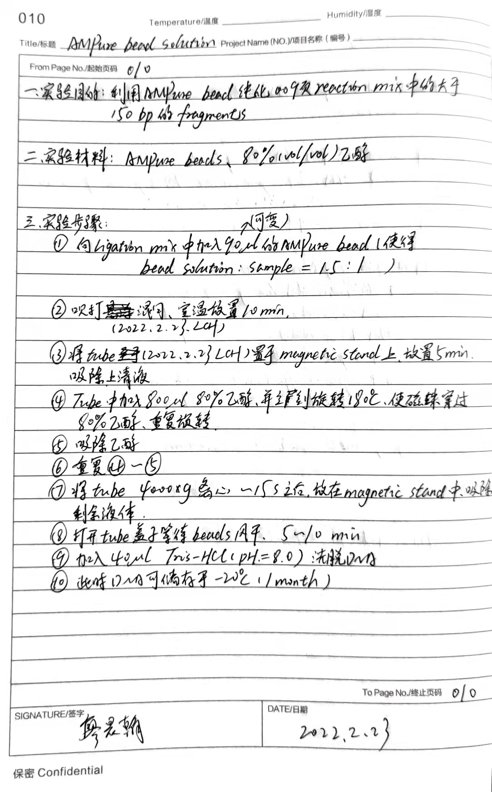
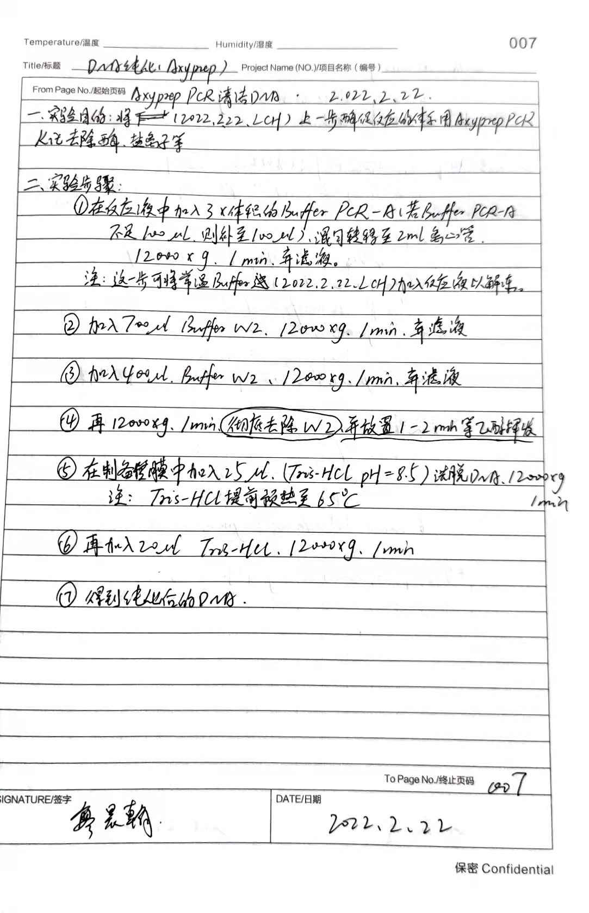
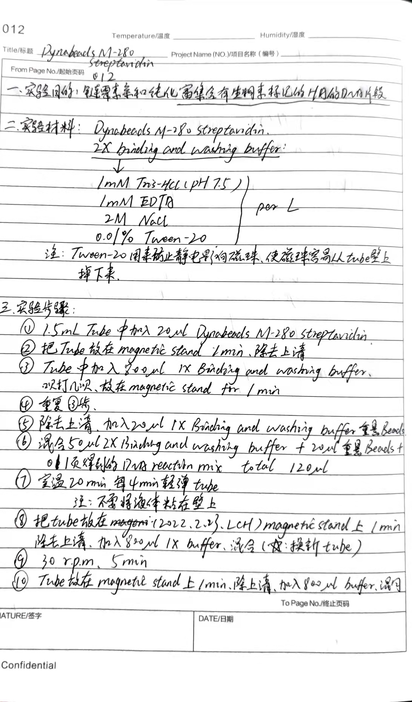
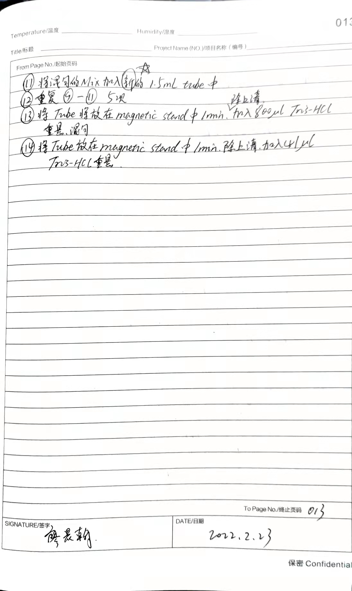
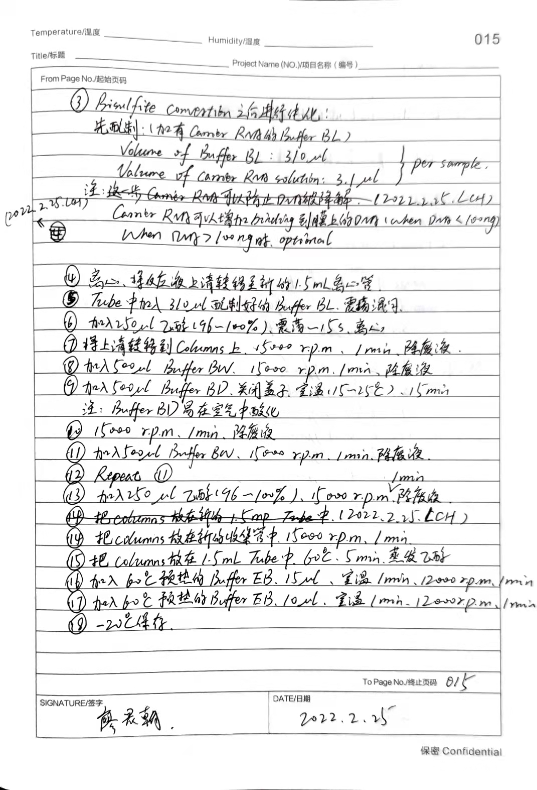
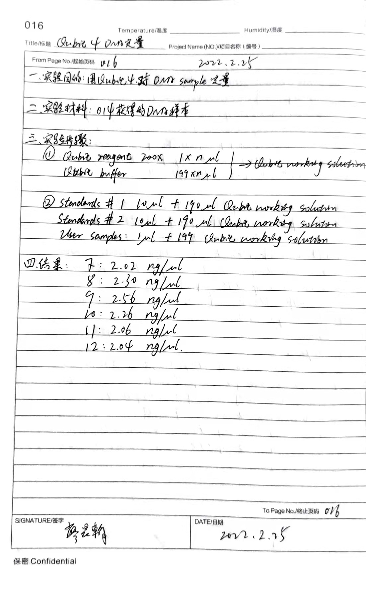
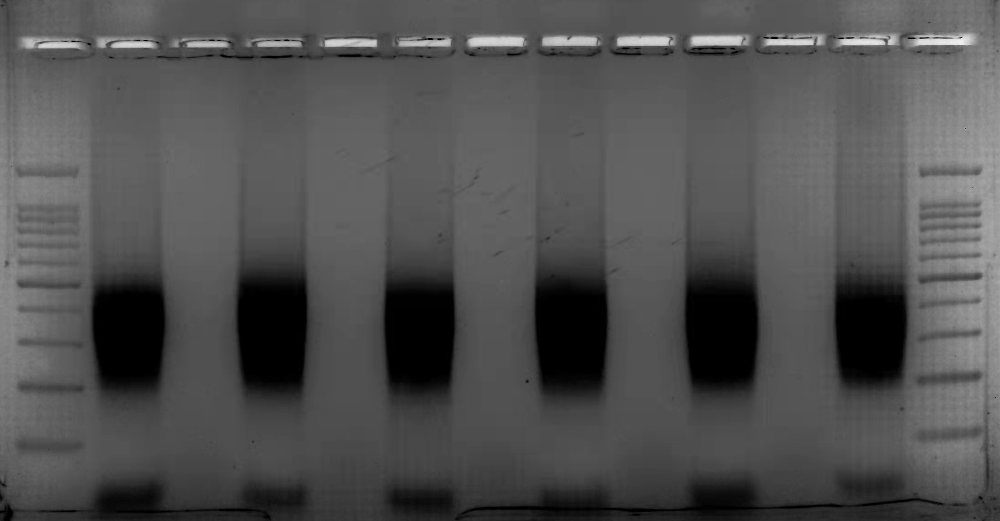
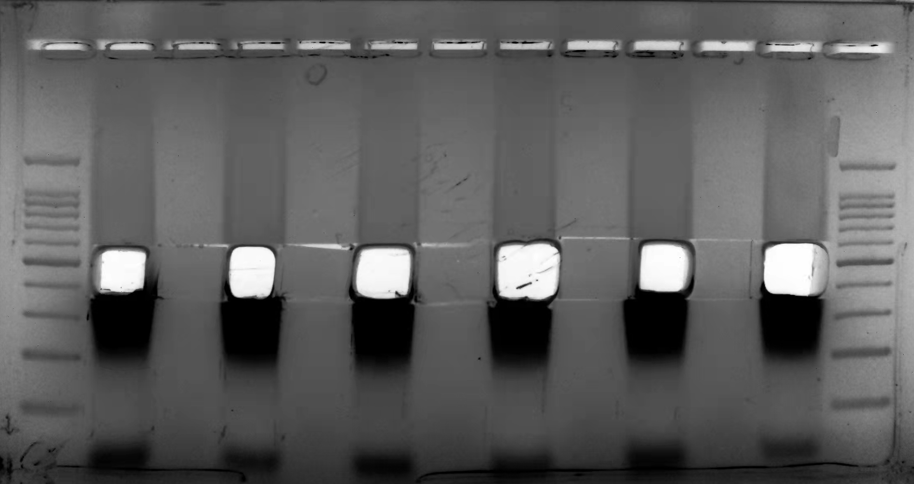
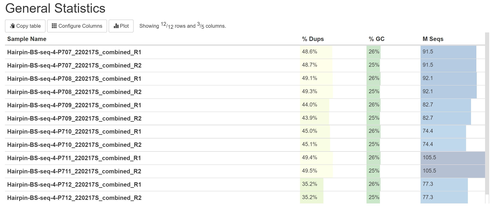
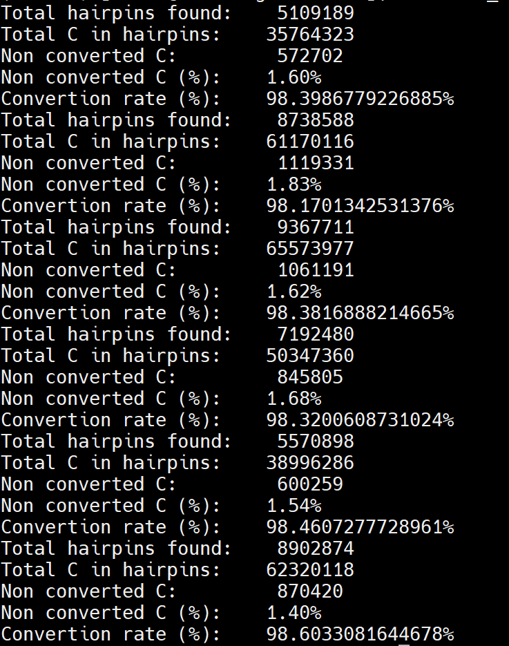

## Work Report 2022.3.6
##### 廖晨翰
-----------
### Hammer-seq测序建库protocol update
#### 1 DNA Shearing
目的：将小鼠基因组打断成150bp左右的DNA双链片段
基因组DNA sample：
```
#515.16 Cerebral WT ----- 6
#81 WT              ----- 7
#84 WT              ----- 8
#82 +/-             ----- 9
#86 +/-             ----- 10
#83 ki              ----- 11
#85 Ki              ----- 12
```

- 将基因组DNA与 Tris-EDTA(pH=8.0)混合，即将DNA稀释到**10 ug/vessel** (总体积130 ul)
**`注： 在稀释之前需要对DNA重新定量`**
- DNA重定量结果：
```
16 --- 520.0
7  --- 695
8  --- 401
9  --- 449
10 --- 216
11 --- 866.3
12 --- 825.7
单位 ng/ul
```
- Covaris S220 参数(Target BP = 150 bp)
```
Peak Incident Power(W) --- 175
Duty factor            --- 10%
Cycles per Burst       --- 200
Treatments Time(s)     --- 430
Water level            --- 12.5
Temperature(℃)        --- 4
```

- AMPure bead 纯化DNA片段
> 这一步为胡甘露老师操作

  
图中的bead solution : sample ratio为富集大于150 bp片段


#### 2 DNA Endrepair
> 将基因组DNA片段末端修复补齐

##### 2.1 End Repair Reaction 
```
DNA                   ----- 50 ul
Buffer End repair 10X ----- 10 ul
Enzyme Mix            ----- 5 ul
ddH2O                 ----- 35 ul
Total                 ----- 100 ul
```
> 温度设置: 20℃, 40 min
##### 2.2 DNA纯化(Axyprep)
> 除去End Repair Mix反应体系中的酶、盐离子等杂质
> 具体操作步骤见试剂盒说明书或实验记录本007页

  

#### 3 DNA dA-Tailing
> 在末端修复过的DNA片段末端加上A碱基
##### 3.1 dA-Tailing Reaction
```
DNA                            ----- 40ul (~10 mg)
NE Buffer 2 (10X)              ----- 5 ul
dATP (10 mM/L)                 ----- 1 ul
Klenow Fragment 3'-5' exo-     ----- 5 ul
Total                          ----- 50 ul
```
> Klenow Fragment 3'-5' exo- 没有3'-5'的内切活性

##### 3.2 Temperature
```
37 ℃ ----- 40 min
65 ℃ ----- 5 min
4 ℃  ----- Hold
```
> 65 ℃使酶失活

##### 3.3 DNA纯化(Axyprep)
> 除去End Repair Mix反应体系中的酶、盐离子等杂质
> 具体操作步骤见试剂盒说明书或实验记录本007页

#### 4 DNA Hairpin Ligation
> 为dA-Tailing过后的DNA片段连接上HA (Hairpin Adapter)和SA (Sequence Adapter)
##### 4.1 Adapter Ligation Reaction
```
DNA from dA-Tailing   ----- 36 ul
SA(15 uM)             ----- 4 ul
HA-1(30 uM)           ----- 9 ul
T4 Ligase Quick       ----- 6 ul
T4 Ligase Buffer(2X)  ----- 55 ul
Total                 ----- 110 ul
```
> HA含有生物素，可用链霉亲和素富集

##### 4.2 Temperature
```
20 ℃    ----- 20 min
65℃     ----- 5 min
4 ℃     ----- Hold
```

##### 4.3 AMPure bead 纯化Ligation Reaction中大于150 bp的DNA片段
> 具体步骤见说明书 or 实验记录本010页

#### 5 Reduce AT Rich Sequence
> 利用Msel(T/TAA) & Mluel(/AATT) 两种限制性内切酶富集DNA片段中CG rich的片段

##### 5.1 Reduce AT Rich Sequence Reaction
```
DNA                      ----- 41 ul
Enzyme Msel              ----- 1 ul
Enzyme Mlucl             ----- 1 ul
Cut Smart Buffer (10X)   ----- 5 ul
ddH20                    ----- 2 ul
Total                    ----- 50 ul
```
##### 5.2 Temperature
```
37 ℃        ----- 60 min
4 ℃         ----- Hold
```

#### 6 Pynabeads M-280 Streptavidin
> 链霉素亲和纯化富集含有生物素标记的HA的DNA片段

Dynabeads M-280 Streptavidin 2X binding and wishing buffer(**1 L体积下**)
```
1 mM Tris-HCl (pH = 7.5)
1 mM EDTA
2M NaCl
0.01% Tween-20
```

> 具体实验步骤见说明书 or 实验记录本012

  
  

#### 7 Bisulfite Convertion
> 将生物素富集得到的DNA片段(含有beads)进行Bisulfite Convertion
试剂盒: Epitect Plus DNA Bisulfite Kit

##### 7.1 Bisulfite Reaction
```
DNA solution       ----- Maximum 40 ul
RNase-free water   ----- Variable
Bisulfite Mix      ----- 85 ul
DNA Protect Buffer ----- 15 ul     (避免DNA片段化)
Total              ----- 140 ul
注: 提前在Bisulfite Mix中加入800 ul RNase-free water，使其充分溶解
当DNA protect buffer由Green转Blue时代表pH合适
```
##### 7.2 Temperature
```
95 ℃      ----- 5 min (Denaturation)
60 ℃      ----- 26 min (Incubation)
95 ℃      ----- 5 min
60 ℃      ----- 60 min
95 ℃      ----- 5 min
60 ℃      ----- 1 h 25 min
95 ℃      ----- 5 min
60 ℃      ----- 2 h 55 min
20 ℃      ----- Hold
注：step 3 - 4 one more cycle to increase bisulfite conversion rate
```
> 具体步骤见说明书 or 实验记录本 014-015页

  

#### 8 Qubit 4 DNA定量
> 具体实验步骤见说明书 or 实验记录本016

  

Qubit 4 定量结果
```
 7      ----- 2.02
 8      ----- 2.30
 9      ----- 2.56
 10     ----- 2.26
 11     ----- 2.06
 12     ----- 2.04
单位：ng/ul
```

#### 9 Amplification of Bisulfite-converted DNA
> PCR扩增bisulfite-converted DNA

##### 9.1 PCR 
```
Bisulfite-converted DNA                  ----- 21 ul
i5 primer(505)                           ----- 1.5 ul
i7 primer(
    707
    708
    709
    710                                  ----- 1.5 ul
    711
    712
)
ddH20                                    ----- 1 ul
KAPA HiFi Hotstart Uracil+ReadyMix(2X)   ----- 25 ul
```
##### 9.2 PCR Program(Round 1)
```
95 ℃        ----- 3 min
---------------------------------
98 ℃        ----- 30 s
65 ℃        ----- 15 s
72 ℃        ----- 1 min
23 cycle
---------------------------------
72 ℃        ----- 5 min 
```
##### 9.3 PCR Program(Round 2)
- 在PCR反应体系中再加入 1 ul i5 primer & 1 ul i7 primer
- 最后反应总体系为52 ul
```
95 ℃        ----- 3 min 30 s
65 ℃        ----- 15 s
72 ℃        ----- 6 min
12 ℃        ----- Hold
注：Round 2，primer不足会导致扩增过程中形成Higher-order structures, Round 2 能disrupt这些Higher-order stuctures
```
##### 9.4 琼脂糖凝胶电泳(2.3%)
> 注：这一步需要重新清洗配胶工具以及电泳槽

  
> 扩增电泳结果，1道与13道都为100 bp marker

  
> 选取350-550 bp条带进行DNA纯化
##### 9.5 DNA Extraction fome Gel


----------------------
### Hairpin-seq Data Process
#### 1 Fastqc
  
> 数据没有特别高的duplicate

#### 2 Bisulfite conversion estimation
>   

#### 3 Trimming
> 正在进行